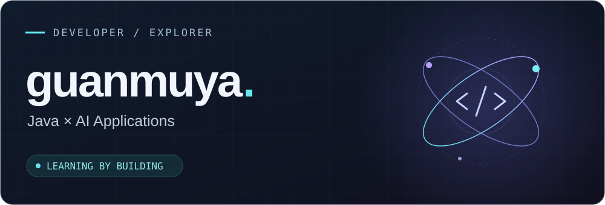

  

  <a href="https://github.com/guanmuya?tab=repositories">Repositories</a> ·
  <a href="#04--connect">Contact</a>

<h2>01 / Hello, world</h2>

你好，我是 <b>Guanmuya</b>。关注 Java 后端与 AI 应用开发，正在一边学习，一边做些小实验。

目前公开的仓库主要是玩具项目和练习。真正想开源的项目，还没有放到 GitHub 上。

<h2>02 / Currently exploring</h2>

<b>Java × AI</b> 探索 Java 后端与大模型应用的结合。 <code>Java</code> <code>Spring AI</code> <code>LangChain4j</code>

<b>Retrieval × Agents</b> 学习知识检索、工具调用，以及 Agent 应用的实现。 <code>RAG</code> <code>MCP</code> <code>LangChain</code> <code>LangGraph</code>

<b>From ideas to experiments</b> 用小项目练习，把想法做出来，再慢慢改进。 <code>Python</code> <code>FastAPI</code> <code>React</code> <code>TypeScript</code>

<h2>03 / Playground</h2>

一些实验与练习，记录探索过程：

<ul>
  <li><a href="https://github.com/guanmuya/agentic_rag_knowledge"><b>Agentic RAG</b></a>：知识库、检索与 Agent 工作流的练习。</li>
  <li><a href="https://github.com/guanmuya/lol_status_query"><b>Python 小工具</b></a>：批量查询与 Excel 自动化的尝试。</li>
</ul>

<a href="https://github.com/guanmuya?tab=repositories">逛逛我的实验区 →</a>

<h2>04 / Connect</h2>

QQ：<b>1121390284</b> GitHub：<a href="https://github.com/guanmuya">@guanmuya</a>

Learning by building. One experiment at a time.

